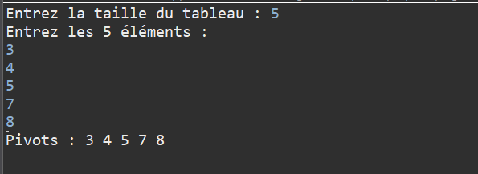
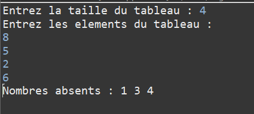
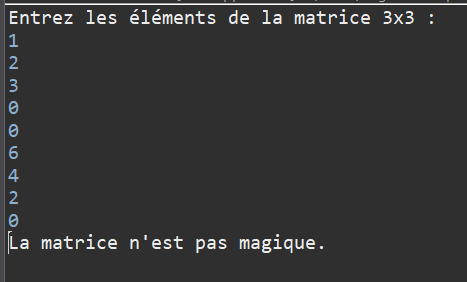

TP 2 : Tableaux en Java

Exercice 1 — Sous-suite maximale croissante

Exercice 2 — Tableau pivot

Exercice 3 — Matrice spirale

Exercice 4 — Recherche d’un rectangle de 1 dans une matrice binaire

Exercice 5 — Permutation circulaire

Exercice 6 — Sous-tableau de somme maximale (Kadane)

Exercice 7 — Fréquence majoritaire (majorité absolue)

Exercice 8 — Nombres absents

Exercice 9 — Somme diagonale dans une matrice carrée

Exercice 10 — Matrice magique 3×3
